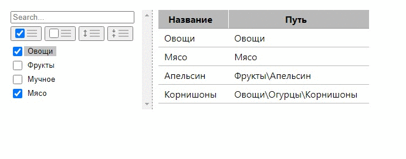

# CategoriesControl



## Описание

Компонент создан с использованием [The official Redux template for Create-React-App](https://github.com/reduxjs/cra-template-redux) и используется в его контексте. Не содержит логики работы с сервером. Код компонента содержится в катологе **categories** и представляет собой "single feature" для папки **features** проекта.

## Формат входных данных

Пример содержится в файле **categories/data.js**

## Зависимости 

Отсутствуют

## Способ использования в проекте

1. Добавить каталог **categories** в каталог **src/features** проекта. 
2. Добавить слайс **categories** в **store**:
```javascript
export const store = configureStore({
  reducer: {
    // опущены другие слайсы
    categories: categoriesReducer,
  },
});
```
3. Импортировать компонент **CategoriesControl** из **categories/CategoriesControl.jsx** и использовать его внутри обертки **Provider**. Например:
```javascript
import { Provider } from 'react-redux'
import { CategoriesControl } from './features/categories/CategoriesControl'

ReactDOM.render(
  <Provider store={store}>
    <CategoriesControl />
  </Provider>,
  document.getElementById('root')
)
```
